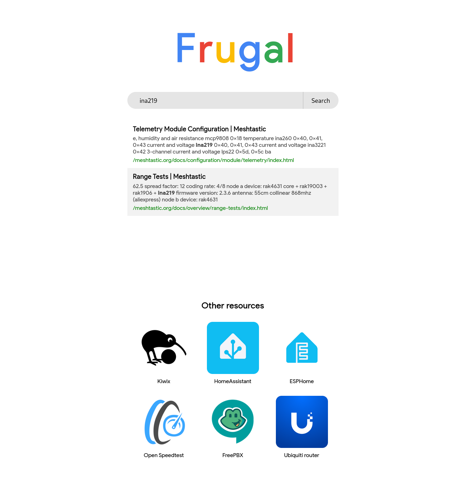

# Frugal

_Just a quick and dirty fun project, to see how hard it would be. Don't expect
it to work for every website. My focus was on fairly static websites, like
documentation sites. Also, the search is pretty sucky._

Frugal is a Docker image that you can run to mirror websites that you want to
have available offline locally. It will check the websites for updates daily,
and update its cache. Behind the scenes the heavy lifting is done by WGET.

Once the websites have been downloaded, it allows you to browse those websites
and to search through them. There's also the option to add additional links to
the home page, making it a great starting page for your local network.



## Build the docker image

```bash
git clone git@github.com:Timendus/frugal.git
cd frugal
make build
```

## Run the docker image

After the previous step, an image `timendus/frugal` should be in your local
Docker, and in `./dist/docker/frugal.tar.gz`. Spin up a container from that image.

When setting up the container, map the container's port 80 to something on the
host system and map `/app/config` in the container to where you want to store
both the configuration and the cache files.

## Configuring

There's two files of note:

### websites.txt

This is a plain text file with URLs, one per line, of the websites that you wish
to have available offline. It's used as an input file for `wget -i`.

### links.json

A JSON file with an array of objects, each representing a link in the "Other
resources" section of the front page. Add whatever other applications you have
running.
